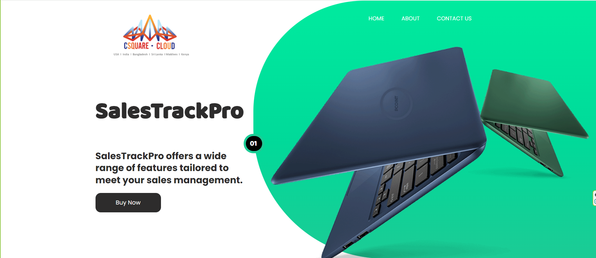
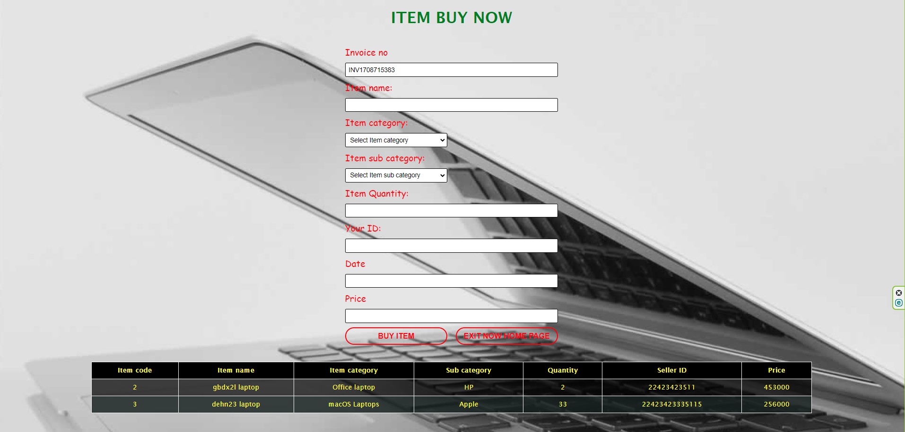
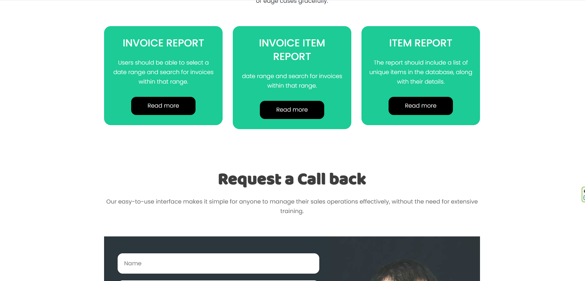

# SalesTrackPro--website
using html,javascript,css,php,mysql database,xaamp
<br>
<br>
<br>
🔧 **Step 1: Setting up the MySQL Database**
1. 🔍 Open phpMyAdmin (accessible via http://localhost/phpmyadmin).
2. 📁 Create a new database named "task_manager".
3. 📋 Create two tables: "customers" and "items" with the specified fields.

**Customers Table:**
```sql
CREATE TABLE customers (
    id INT AUTO_INCREMENT PRIMARY KEY,
    title VARCHAR(10),
    first_name VARCHAR(50),
    last_name VARCHAR(50),
    contact_number VARCHAR(20),
    district VARCHAR(50)
);
```

**Items Table:**
```sql
CREATE TABLE items (
    id INT AUTO_INCREMENT PRIMARY KEY,
    item_code VARCHAR(20),
    item_name VARCHAR(100),
    item_category VARCHAR(50),
    item_subcategory VARCHAR(50),
    quantity INT,
    unit_price DECIMAL(10, 2)
);
```

🔧 **Step 2: Setting up the PHP Backend**
- **For Customer:** Create `customer.php` with appropriate functionalities.
- **For Item:** Create `item.php` mirroring the structure of `customer.php`.

🔧 **Step 3: Frontend HTML Forms**
Create HTML forms to collect customer and item details, ensuring proper validation using JavaScript or HTML5 attributes.

🔧 **Step 4: Reports**
Generate PHP scripts to query the database for generating reports based on selected date ranges.

🔧 **Step 5: Running the Application**
1. 📂 Place PHP and HTML files in the project folder within the htdocs directory.
2. 🌐 Access the application via http://localhost/your_project_folder.
3. 🎉 Enjoy utilizing the software for customer and item registration along with report generation functionalities.

🎉 **Step 6:Project GUI**





🔗 **Connect with Me:**
<li>[LinkedIn]([Asela Gayan](https://www.linkedin.com/in/asela-gayan-503687212/))</li>

🌈 **Let's Collaborate:**
<p>Open to collaboration, feedback, and new opportunities. Whether you're a fellow developer, recruiter, or enthusiast, let's connect and create something extraordinary together! 🚀</p>


⭐ Thank you for visiting my GitHub repository! Feel free to explore, fork, and provide feedback. Happy coding! ⭐
